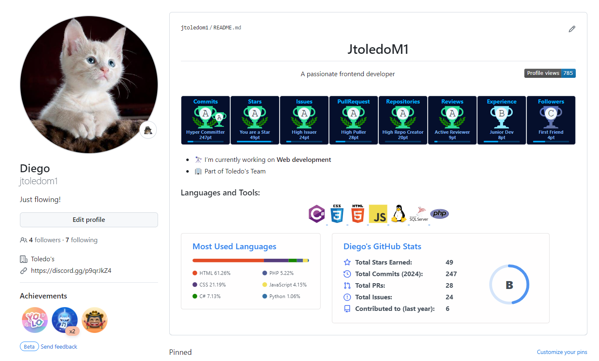

# Ayudas adicionales

En esta parte encontrarás elementos que NO son esenciales pero te pueden ayudar mucho

## Git README
El readme en es un elemento fundamental ya que ayudas a otras personas a conocer tu repositorio. Es una guía donde añadirás la descripción o bien el método de instalación de tu proyecto.

## Repositorios especiales

Al crear un repositorio con el mismo nombre que tu usuario de github se creará una descripción en tu perfil que podrás editar desde el readme de dicho repo. 

Este es un ejemplo pero puedes modificarlo tanto como gustes:

 

